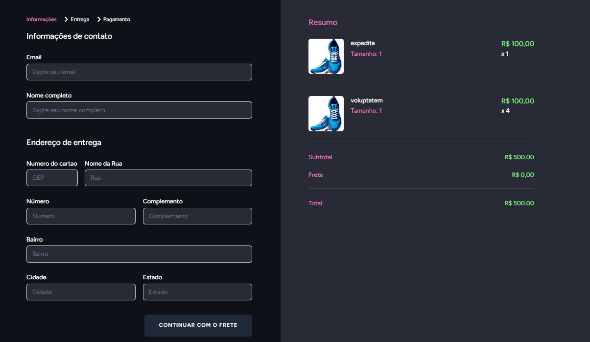
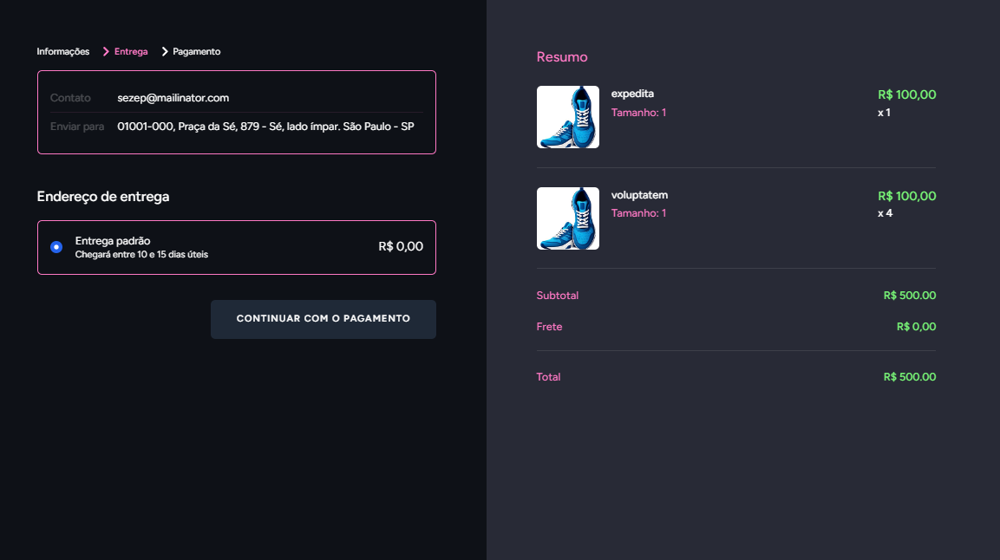
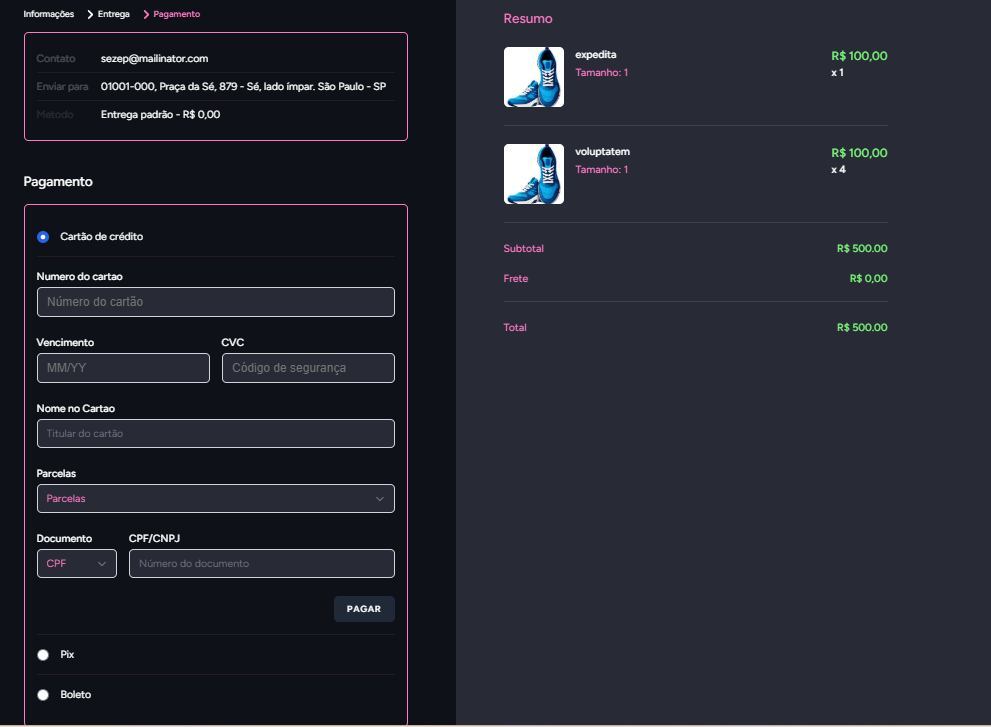
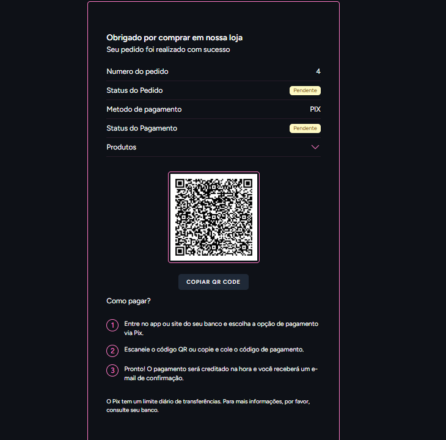

<p align="center">
    <a with="500">
        
    </a>
    <a with="500">
        
    </a>
    <a with="500">
        
    </a>
    <a with="500">
        
    </a>
</p>

## Laravel Project Series

Projeto Checkout integrado ao gateway de pagamentos do Mercado Pago.<br>

Este projeto utiliza contêineres Docker, configurados através do pacote Laravel Sail, para simplificar a configuração do ambiente de desenvolvimento. Por isso, é necessário ter o Docker e o Docker Compose previamente instalados em sua máquina.

Embora seja possível executar o projeto em um ambiente local sem Docker, este guia aborda exclusivamente a configuração utilizando contêineres.

### Passos para Configurar e Executar o Projeto Localmente

- Clone o repositório para sua máquina local.
- Crie um arquivo .env utilizando o .env-example como base.
- Atualize as configurações no .env conforme suas necessidades.
- Acesse a pasta do projeto pelo terminal (console/PowerShell/CMD).
- Execute o seguinte comando:
```shell
docker run --rm \
    -u "$(id -u):$(id -g)" \
    -v "$(pwd):/var/www/html" \
    -w /var/www/html \
    laravelsail/php82-composer:latest \
    composer install --ignore-platform-reqs
 ```
- Após o término do processamento, inicie os serviços do contêiner executando o comando:
```shell
./sail up -d
```

### Configuração de Credenciais do Mercado Pago

Para integrar o projeto ao Mercado Pago, é necessário:

- Criar uma conta no <a href="https://openlaravelweek.com.br/p1-v1/](https://www.mercadopago.com.br/developers/pt" target="_blank">Mercado Pago Developers</a>.
- Criar uma aplicação do tipo **checkoutTransparente**. 
- Acessar o painel de desenvolvedores e obter as credenciais de teste (Public Key e Access Token).
- Copiar essas credenciais para o arquivo .env do projeto, preenchendo os campos correspondentes.

Exemplo de configuração no .env:
```shell
VITE_MERCADO_PAGO_PUBLIC_KEY=SEU_ACCESS_TOKEN_AQUI
MERCADO_PAGO_ACCESS_TOKEN=SUAS_PUBLIC_KEY_AQUI
```
